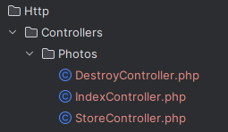
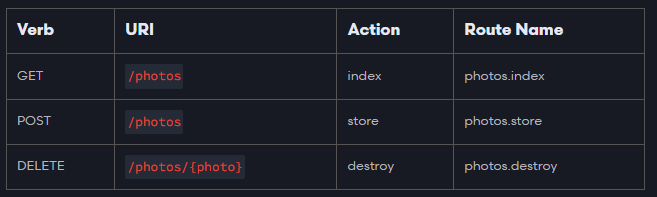

# About Single Actions Resource Controllers

This package extends Laravel Router with new feature - Route::singleActionResource()  
It's combination of [Route::resource](https://laravel.com/docs/11.x/controllers#resource-controllers) together
with [Single Action Controllers](https://laravel.com/docs/11.x/controllers#single-action-controllers).
If you are interested in small highly cohesive controller classes that follow standard naming convention this package is
definitely for you.

## How does it work?

It's really simple:

- Just add new single action resource route in your routes file, e.g `Route::singleActionResource('photos');`
- Create new [Single Action Controllers](https://laravel.com/docs/11.x/controllers#single-action-controllers) for each
  action you need, like this:  
  
- This will automatically create routes these routes:   
  

## Installation

You can install the package via composer:

``` bash
composer require clean-bandits/single-action-resource-controllers-for-laravel
```

Optionally you can publish the config file with:

``` bash
php artisan vendor:publish --provider="CleanBandits\SingleActionResourceControllers\SingleActionResourceControllersProvider" --tag="config"`  
```

This is the contents of the published configuration file:

```php
return [
    /*
     * Specify root namespace where your single action resource controller folder will reside
     */
    'controllers_namespace' => 'App\\Http\\Controllers\\',

    /*
     * This class is responsible for building Resource controllers naming and location.
     * By default they reside inside namespace -> controllers_namespace+resource_name+action,
     * e.g. App\Http\Controllers\Photos\IndexController
     * To take full control of controller namespace creation,
     * you can provide your own class that implements ResourceController
     */
    'resource_controller' => DefaultResourceController::class,
];
```

## Testing

``` bash
composer test
```
